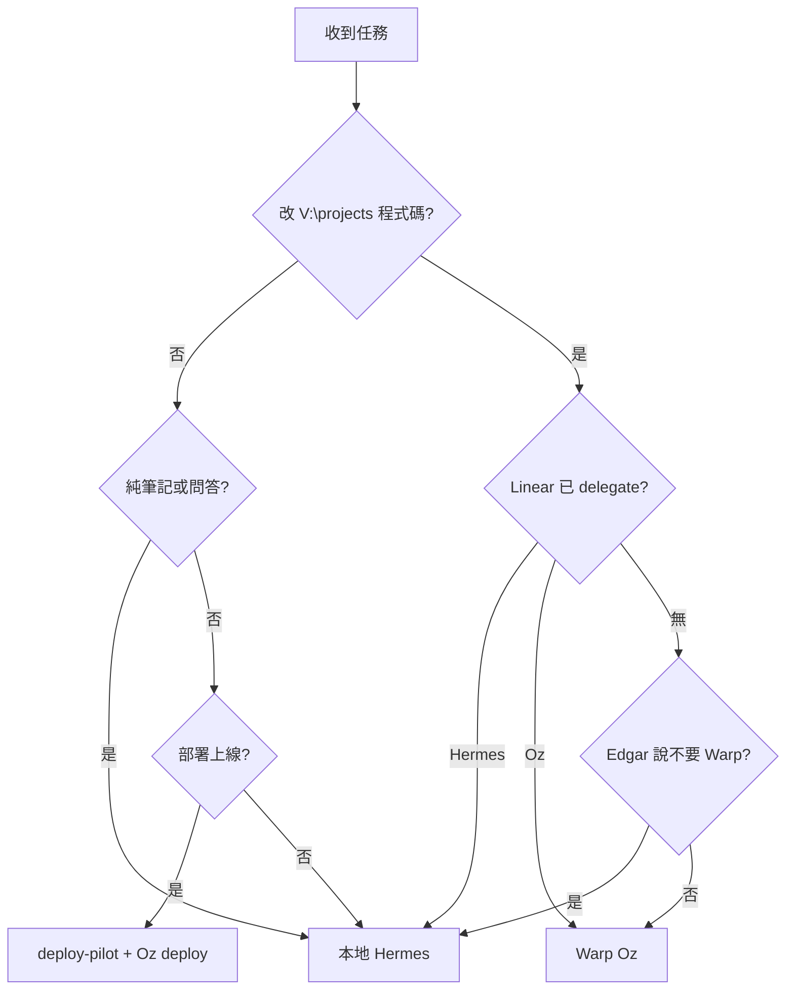

# Warp Oz Router（分工決策）

## Overview

任何 Agent 收到任務時，**先查這張表**再動手。避免 Hermes 與 Oz 搶同一張單、避免浪費 Warp credits、避免該開 PR 卻只在本地改一半。

```
任務進來
  ├─ 純問答 / 筆記 / 本地工具？     → 本地 Hermes
  ├─ 改 V:\projects code / 開 PR？  → Warp Oz（ask-warp 或 Linear @Oz）
  ├─ 部署上線？                     → deploy-pilot + Oz deploy env
  └─ 已在 Linear delegate 某 agent？ → 尊重既有 delegate，不換人
```

## Routing Table

| 任務類型 | 給誰 | 觸發方式 |
|---------|------|---------|
| 解釋、摘要、查狀態、整理 issue | **本地 Hermes** | Linear Delegate → Hermes Agent |
| 改 `V:\projects` 原始碼、開 PR | **Warp Oz** | `ask-warp.ps1` 或 Linear Delegate → Oz |
| 部署 staging / production | **deploy-pilot + Oz** | `warp-oz-deploy` → `ask-warp -Project deploy` |
| 純筆記 `G:\AgentKB`、`G:\Obsidian` | **本地 Hermes** | 不叫 Warp |
| 需要 `~/.hermes` 記憶的對話 | **本地 Hermes** | 不叫 Warp |
| 只查 log、診斷、不改檔 | **本地 Hermes** | 不叫 Warp |
| CI 失敗自動修 / PR review | **Warp Oz** | GitHub Actions（見 `warp-oz-github-actions`） |
| Slack 協作叫 agent | **Warp Oz** | `@Oz`（見 `warp-oz-slack`，若已設定） |

## Keyword Quick Reference

| 關鍵字 / 意圖 | 路由 |
|--------------|------|
| 開 PR、實作、refactor、fix bug、加測試 | Oz |
| 什麼意思、怎麼運作、摘要、explain | Hermes |
| deploy、上線、rollback、healthcheck | deploy-pilot + Oz `deploy` |
| Linear 狀態、誰負責、issue 整理 | Hermes |
| commit、push、branch（在 V:\projects） | Oz |
| Edgar 說「不要叫 Warp」「這張 Hermes 就好」 | Hermes |

## Linear Delegate Rules

```
Linear issue
  ├─ Delegate → Hermes Agent  →  :8645 linear-orchestrator → comment 回寫
  └─ Delegate → Oz              →  Warp cloud → PR + Linear 進度
```

**硬性規則：**
- 同一張 issue **只 delegate 一個** agent
- 已 delegate Oz → **不要**本地 Hermes 重複做同一件事
- 已 delegate Hermes → **不要**再叫 `ask-warp.ps1` 做同一任務
- 人類問「這張單給誰」→ 用本表建議，由 Edgar 在 Linear 點 Delegate

## Environment Selection (Oz)

| 專案類型 | `-Project` | Environment |
|---------|------------|-------------|
| linear-orchestrator、Python Linear 工具 | `linear` | `edgar-linear-dev` |
| 部署、deploy-pilot 流程 | `deploy` | `deploy-pilot` |
| 其他 Node / 多 repo（hermes-inn-UI 等） | `general` | `new world` |

Environment repo 沒包含目標專案時 → 在 oz.warp.dev 更新 environment 或換 `general`。

## Decision Flow



## When to Use This Skill

- 使用者問「這要給 Hermes 還是 Oz？」
- Cursor Agent 準備改 `V:\projects` 程式碼前
- Linear issue 指派建議
- 避免重複工作或 credits 浪費

## Related Skills

| Skill | 用途 |
|-------|------|
| `warp-oz-cursor` | Cursor 怎麼叫 `ask-warp.ps1` |
| `warp-oz-linear` | Linear Delegate → Oz 設定 |
| `warp-oz-deploy` | 部署專線 prompt 與驗收 |
| `warp-oz-monitor` | Oz 跑完後盯結果 |
| `linear-webhook-bridge` | Linear → 本地 Hermes 管線 |

## Common Pitfalls

1. **Hermes + Oz 同時做同一 issue** → 只選一個
2. **該開 PR 卻只本地改** → 改 code 應走 Oz
3. **純問答卻叫 Warp** → 浪費 credits
4. **部署卻用 `general` env** → 應用 `deploy` + `warp-oz-deploy`
